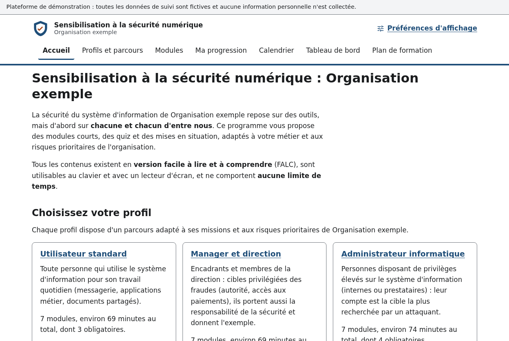
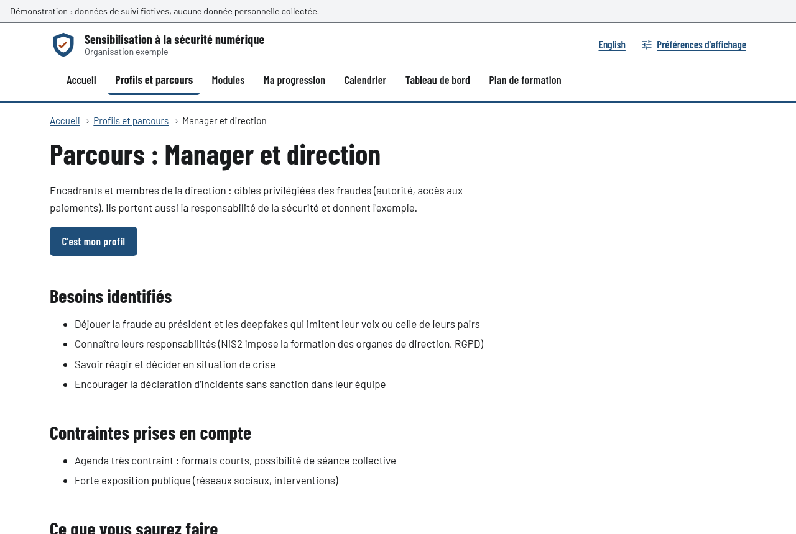
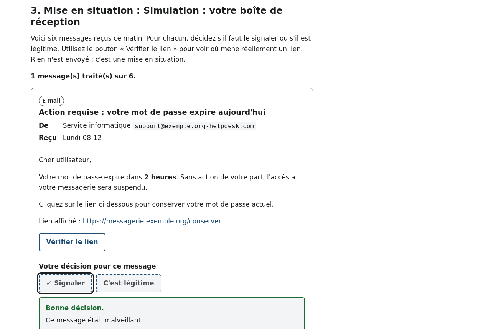
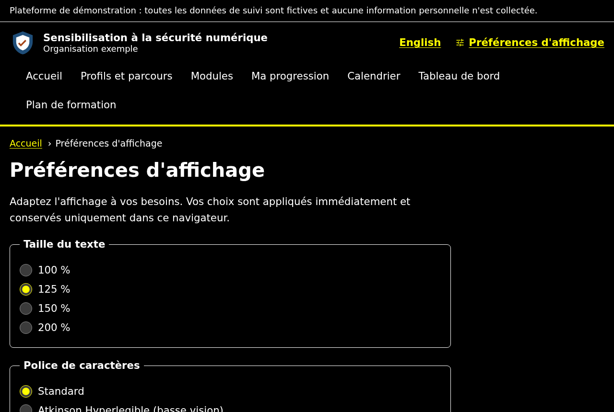
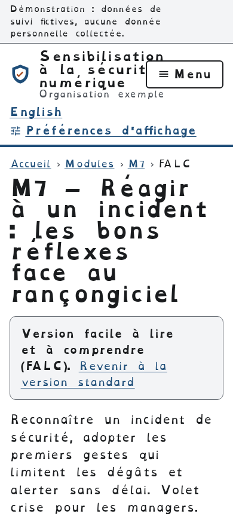
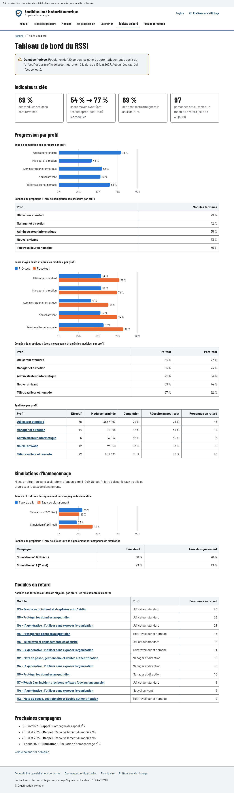

# Plateforme de sensibilisation et de formation à la sécurité du SI

Plateforme web **générique, accessible et paramétrable** pour sensibiliser et former les utilisateurs d'une organisation à la sécurité de son système d'information. Tout ce qui est propre à une organisation (nom, couleurs, profils, risques prioritaires, réglementations, fréquences) est décrit dans **un seul fichier de configuration**. Les contenus pédagogiques (Markdown et JSON) sont séparés du code.

La configuration livrée décrit une **« Organisation exemple »** neutre (PME tous secteurs). Toutes les données de suivi sont **fictives** : aucune donnée personnelle n'est collectée et aucun e-mail n'est envoyé (les simulations d'hameçonnage sont des mises en situation affichées dans la plateforme).



## Sommaire

- [Démarrage rapide](#démarrage-rapide)
- [Fonctionnalités](#fonctionnalités)
- [Correspondance avec les critères d'évaluation](#correspondance-avec-les-critères-dévaluation)
- [Accessibilité](#accessibilité)
- [Sécurité de l'application](#sécurité-de-lapplication)
- [Architecture](#architecture)
- [Adapter la plateforme à une organisation](docs/adapter-a-une-organisation.md)
- [Ajouter ou modifier un module](docs/adapter-a-une-organisation.md#6-ajouter-ou-modifier-un-module)
- [Grille d'audit manuel d'accessibilité](docs/audit-accessibilite-manuel.md)
- [Déploiement gratuit (Cloudflare Pages)](#déploiement-gratuit-cloudflare-pages)

## Démarrage rapide

Prérequis : **Node.js 22.12 ou plus récent** (le fichier `.nvmrc` indique la version 24 LTS).

```bash
nvm use            # si vous utilisez nvm
npm install
npm run dev        # http://localhost:4321
```

| Commande | Rôle |
| --- | --- |
| `npm run dev` | Serveur de développement avec rechargement automatique |
| `npm run check` | Valide la configuration et **tous** les contenus, affiche les parcours calculés |
| `npm run build` | Valide puis génère le site statique dans `dist/` |
| `npm run preview` | Sert `dist/` avec les **mêmes en-têtes de sécurité** qu'en production |
| `npm test` | Tests unitaires (moteur de parcours, contrastes, calendrier, validation…) |
| `npm run test:e2e` | Audit d'accessibilité axe-core de chaque page, tests clavier, CSP, sécurité |
| `npm run test:tout` | Tous les tests (unitaires, build, bout en bout) |
| `npm run plan` | Exporte le **plan de sensibilisation** en Markdown et PDF dans `exports/` |
| `npm run captures` | Régénère les captures d'écran de ce README |
| `npm run schema` | Régénère le schéma JSON de la configuration (autocomplétion dans l'éditeur) |

> Tests de bout en bout : la première fois, installez le navigateur avec `npx playwright install chromium`, ou utilisez le Chromium du système : `CHROMIUM_PATH=/usr/bin/chromium npm run test:e2e`.

## Fonctionnalités

| Fonctionnalité | Description |
| --- | --- |
| **5 profils** | Utilisateur standard, manager et direction, administrateur informatique, nouvel arrivant, télétravailleur et nomade : besoins, contraintes, objectifs pédagogiques (taxonomie de Bloom) reliés aux modules |
| **8 modules** | Hameçonnage et quishing, mots de passe et MFA, fraude au président et deepfakes, IA générative, protection des données, nomadisme, réaction à incident, hygiène d'administration |
| **Parcours calculés** | Ordre déterminé par l'analyse de risques de la configuration : socle obligatoire, puis modules prioritaires classés par score, avec la justification visible (« Pourquoi ce module ? ») |
| **Moyens variés** | Pré-test, contenu court, simulation de boîte de réception, scénarios à embranchements, post-test, fiches « À retenir », audio sous-titré et transcrit |
| **Version FALC** | Chaque module et chaque question de quiz existent en version facile à lire et à comprendre |
| **Évaluation** | Pré-test / post-test, seuil de réussite configurable, progression individuelle (stockée dans le navigateur uniquement) |
| **Tableau de bord RSSI** | Complétion et scores par profil, simulations d'hameçonnage, modules en retard, prochaines campagnes (population fictive reproductible) |
| **Calendrier annuel** | Généré depuis les fréquences de la configuration, exportable en `.ics` |
| **Plan exporté** | Document complet (profils, objectifs, risques, modules, moyens, accessibilité, évaluation, fréquences), en Markdown et en PDF |

| Parcours d'un profil | Simulation d'hameçonnage |
| --- | --- |
|  |  |

| Préférences : contraste renforcé | Mobile : version FALC et police dyslexie |
| --- | --- |
|  |  |



## Correspondance avec les critères d'évaluation

| Critère | Où le constater dans la plateforme |
| --- | --- |
| 1. Profils et besoins identifiés | Page **Profils et parcours** ; section 3 du plan exporté |
| 2. Objectifs pédagogiques par profil | Tableau des objectifs de chaque profil (niveau visé, modules qui l'évaluent) ; section 4 du plan |
| 3. Analyse de risques et nouvelles technologies | `risquesPrioritaires` de la configuration → ordre des parcours et « Pourquoi ce module ? » ; menaces émergentes signalées (IA générative, deepfakes, quishing) ; section 2 du plan |
| 4. Moyens variés et adaptés au handicap | Quiz, simulation de boîte mail, scénarios, audio transcrit ; FALC, préférences d'affichage, clavier, lecteurs d'écran, aucune limite de temps ; section 6 et 7 du plan |
| 5. Évaluation définie et accessible | Pré-test / post-test, page **Ma progression**, **Tableau de bord** par profil (graphiques doublés de tableaux) ; section 8 du plan |
| 6. Fréquence de renouvellement | Page **Calendrier** (fréquences par action et par module, export `.ics`) ; section 9 du plan |

## Accessibilité

Objectif : **RGAA 4.1 / WCAG 2.2 niveau AA**.

- Navigation 100 % clavier, lien d'évitement, focus visible (contour de 3 px), ordre de tabulation logique.
- Structure sémantique : régions (en-tête, navigation, contenu, pied de page), titres hiérarchisés, un seul `h1` par page, titres de page uniques, fil d'Ariane, plan du site.
- Formulaires : chaque question est un groupe `fieldset` / `legend` ; les erreurs sont listées avec des liens vers les questions et reçoivent le focus.
- Retours dynamiques : le focus est déplacé vers le résultat ou l'étape suivante ; statuts toujours écrits (jamais portés par la seule couleur).
- **Contrastes vérifiés automatiquement** : les couleurs de l'organisation sont contrôlées au build (≥ 4,5:1 sur les fonds clairs, et variantes calculées pour le thème sombre) et corrigées si besoin, ou le build échoue (`correctionContrasteAuto: false`).
- Préférences : taille du texte (jusqu'à 200 %), polices Atkinson Hyperlegible (basse vision) et OpenDyslexic, espacement du texte (WCAG 1.4.12), thème sombre, contraste renforcé, réduction des animations, version FALC par défaut.
- Aucune limite de temps ; médias sans lecture automatique, avec sous-titres et transcription obligatoires (le build échoue s'ils manquent).
- Graphiques du tableau de bord : palette validée pour les daltonismes, légende, motif hachuré, valeurs écrites et **tableau de données systématique**.
- Page **Déclaration d'accessibilité** (modèle RGAA), éditable dans `contenus/pages/accessibilite.fr.md`.

**Tests automatisés** (`npm run test:e2e`) :
- audit axe-core (WCAG 2.0 / 2.1 / 2.2 A et AA) de **chaque page** générée ;
- le même audit avec les thèmes sombre et contraste renforcé, puis avec texte à 200 %, police dyslexie et espacement augmenté ;
- absence de défilement horizontal à 320 px ;
- parcours au clavier seul : quiz, simulation d'hameçonnage, scénario, préférences.

Les tests automatisés ne détectent qu'une partie des défauts : un **audit manuel** avec NVDA (Firefox) et VoiceOver (Safari) reste à réaliser, avec la [grille d'audit manuel](docs/audit-accessibilite-manuel.md) (40 vérifications rattachées au RGAA), puis à consigner dans la déclaration d'accessibilité.

## Sécurité de l'application

- **Site 100 % statique** : aucun serveur applicatif, aucune base de données, aucune authentification à attaquer.
- **CSP stricte** sans `unsafe-inline` : aucun script ni style en ligne n'est produit (vérifié par les tests), aucune ressource externe (polices hébergées localement).
- En-têtes HTTP (`public/_headers`) : CSP, HSTS, `X-Content-Type-Options`, `X-Frame-Options`/`frame-ancestors`, `Referrer-Policy`, `Permissions-Policy`, COOP/CORP. Une balise `meta` CSP sert de repli si l'hébergeur ignore `_headers`.
- **Validation des entrées** :
  - configuration et contenus validés par des schémas stricts (Zod ; toute clé inconnue est refusée), avec références croisées vérifiées ;
  - rendu Markdown sûr par construction (micromark échappe le HTML brut et neutralise les URL `javascript:`) ;
  - données relues depuis `localStorage` revalidées, texte injecté uniquement via `textContent`.
- **Aucun secret** dans le code ni dans la configuration (qui ne contient que des données publiques). La CI lance **gitleaks** sur l'historique.
- **Dépendances** : peu nombreuses et à jour, Dependabot hebdomadaire, scripts d'installation npm bloqués par défaut. L'audit (`npm run audit`, en CI) bloque toute vulnérabilité haute ou critique, sauf **exception documentée et datée** dans [`securite/exceptions-audit.json`](securite/exceptions-audit.json) (justification, date de revue, date d'expiration). À l'échéance, la CI bloque de nouveau et impose une nouvelle analyse du risque.
- Simulations d'hameçonnage : les liens affichés ne sont **jamais cliquables** (vérifié par un test).

## Architecture

```
config/
  organisation.json          ← LE fichier à modifier pour une organisation
  organisation.schema.json   ← schéma généré (autocomplétion dans l'éditeur)
  exemples/clinique.json     ← second exemple (secteur santé)
contenus/                    ← contenus pédagogiques, sans code
  risques.json               ← catalogue des risques (dont menaces émergentes)
  profils/*.json             ← profils : besoins, objectifs, exposition
  modules/<id>/              ← module.json, standard.fr.md, falc.fr.md, quiz.json, scenario.json
  secteurs/<secteur>/        ← modules sectoriels optionnels
  pages/*.fr.md              ← accueil, déclaration d'accessibilité, confidentialité
src/
  lib/                       ← moteur : config, contrastes, contenus, parcours, calendrier, indicateurs, plan
  components/                ← Quiz, Scenario, BoiteMail, Media, GraphiqueBarres…
  pages/                     ← routes du site
  scripts/                   ← code navigateur (progression locale, statuts)
  i18n/                      ← textes d'interface (fr.json ; en.json à compléter)
scripts/                     ← vérification, serveur local sécurisé, export du plan, captures
tests/unit, tests/e2e        ← Vitest ; Playwright + axe-core
```

**Choix techniques** : [Astro](https://astro.build) génère un site statique ; les parties interactives sont en TypeScript natif qui enrichit un HTML déjà complet (pas de framework côté client). C'est plus simple à auditer, cela réduit les dépendances et c'est compatible avec une CSP stricte.

**Langues** : français par défaut, **anglais** publié sous `/en/` (`"langues": {"defaut": "fr", "disponibles": ["fr", "en"]}`). L'interface est entièrement traduite (`src/i18n/fr.json`, `en.json`). Côté contenus, les risques, les profils, les pages éditoriales, les métadonnées des modules et le module M1 sont traduits ; les autres modules s'affichent en français avec un avis, et sont balisés `lang="fr"` pour les lecteurs d'écran (RGAA 8.7). Voir [Traduire un contenu](docs/adapter-a-une-organisation.md#9-traduire-un-contenu).

## Déploiement gratuit (Cloudflare)

Le fichier [`wrangler.jsonc`](wrangler.jsonc) décrit le déploiement : Cloudflare publie le dossier `dist/` comme **ressources statiques** (aucun code serveur), et applique les en-têtes de sécurité de `dist/_headers`.

1. Dans Cloudflare, ouvrez **Workers & Pages → Créer → importer un dépôt Git**, puis choisissez le dépôt.
2. Paramètres :
   - **Commande de build** : `npm run build`
   - **Commande de déploiement** : `npx wrangler deploy` (valeur proposée par défaut)
   - **Variables** : `NODE_VERSION = 24` ; pour une autre organisation, `ORGANISATION_CONFIG = config/mon-organisation.json`
3. Déployez. Chaque `git push` sur `main` redéploie automatiquement le site.

> N'ajoutez pas l'adaptateur `@astrojs/cloudflare` : il sert au rendu côté serveur, inutile ici, et il ferait échouer le build (la configuration est lue sur le disque pendant la génération). La présence de `wrangler.jsonc` empêche Wrangler de l'installer automatiquement.

Vérifier en local, sans rien publier : `npm run build && npx wrangler deploy --dry-run`. Vérifier les en-têtes une fois en ligne : `curl -I https://<projet>.<compte>.workers.dev` ou [securityheaders.com](https://securityheaders.com).

## Licence et crédits

Polices : Atkinson Hyperlegible Next (Braille Institute) et OpenDyslexic, sous licence SIL Open Font License, via Fontsource. Contenus rédigés à partir des recommandations publiques de l'ANSSI, de la CNIL et de Cybermalveillance.gouv.fr.
